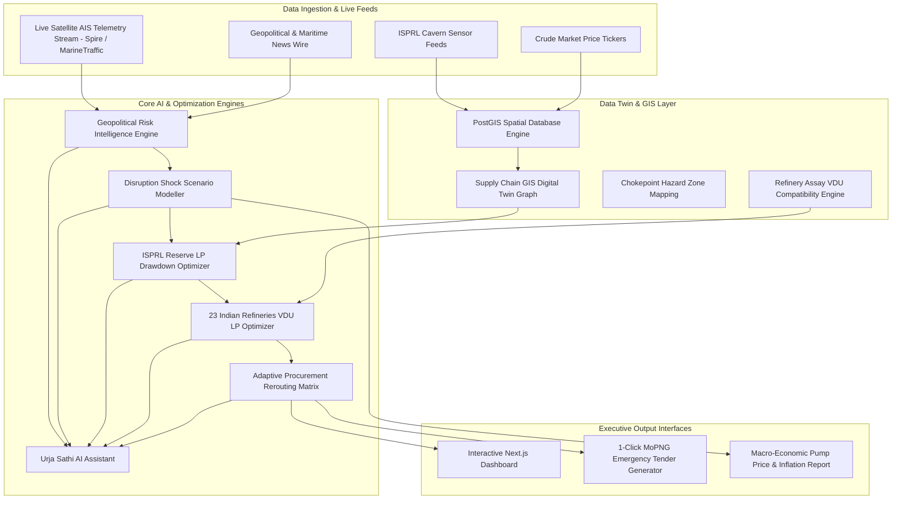
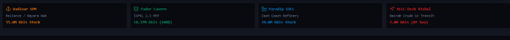
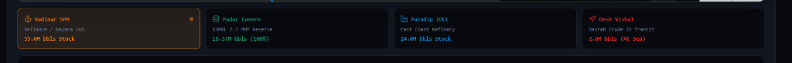
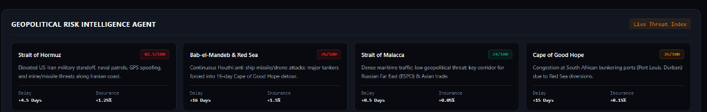
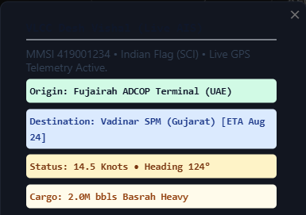

# India Energy Intelligence — UrjaAegis AI (ऊα)

> **AI-Driven Energy Supply Chain Resilience Engine for Import-Dependent Economies**

[](https://www.python.org/downloads/)
[](https://fastapi.tiangolo.com/)
[](https://nextjs.org/)
[](LICENSE)

---

## Live Production Demo & Repository Links

- **Live Production Railway App**: [https://india-energy-intelligence-production.up.railway.app](https://india-energy-intelligence-production.up.railway.app)
- **Local Dev Dashboard**: [http://localhost:3000](http://localhost:3000)
- **GitHub Repository**: [https://github.com/sohan1saha/India-energy-intelligence](https://github.com/sohan1saha/India-energy-intelligence)

---

## 30-Second Project Explanation

India imports **~88% of its crude oil demand (~4.5M bpd)**, with over **45% transiting through a single geopolitical flashpoint: the Strait of Hormuz**. Recent Middle Eastern conflicts, US-Iran naval standoffs, and Houthi missile strikes off the Bab-el-Mandeb Strait have forced supertankers into 16-day detours around the Cape of Good Hope, adding $1.8M in fuel surcharges per voyage and threatening severe refining deficits.

With India's **Strategic Petroleum Reserves (ISPRL)** covering only **~9.5 days of national consumption**, manual procurement decision-making is too slow to mitigate systemic shocks. 

**UrjaAegis AI (ऊα)** is a full-stack AI/ML decision-support platform. It continuously ingests live AIS satellite vessel telemetry and geopolitical threat feeds, models macroeconomic price & pump shocks across India, solves multi-objective Linear Programming (LP) reserve drawdowns while enforcing a strict 15% military floor, models VDU blending across **all 23 Indian oil refineries**, and generates executable MoPNG emergency rerouting tender specifications within seconds.

---

## System Architecture Diagram



---

## Feature Screenshots

### 1. Geopolitical Risk Radar & Chokepoint Threat Index


### 2. Supply Chain GIS Digital Twin & Telemetry Map


### 3. Disruption Scenario Sandbox & Macroeconomic Impact Simulator


### 4. ISPRL Strategic Petroleum Reserve LP Drawdown Optimizer


### 5. Adaptive Procurement Rerouting Matrix & Tender Generator


### 6. Live War & Conflict Maritime News Intelligence Wire


---

## AI/ML & Analytical Methodology

### 1. Geopolitical Risk Scoring Formula
The Threat Score $R_c \in [0, 100]$ for each maritime transit corridor $c$ (Hormuz, Red Sea, Malacca, Cape of Good Hope) is computed dynamically:

$$R_c = \min\left(100, \, w_1 \cdot I_{\text{conflict}} + w_2 \cdot \Delta T_{\text{transit}} + w_3 \cdot P_{\text{war\_insurance}} + w_4 \cdot \rho_{\text{density}}\right)$$

Where:
- $I_{\text{conflict}}$: Conflict Intensity Score derived from NLP extraction of maritime bulletins.
- $\Delta T_{\text{transit}}$: Average transit delay in days (+16.0 days for Red Sea diversions).
- $P_{\text{war\_insurance}}$: War risk insurance premium surcharge percentage (+1.25% to +1.50%).
- $\rho_{\text{density}}$: Vessel queue congestion density near chokepoint coordinates.

### 2. Macroeconomic Disruption Shock Propagation
When a corridor blockade occurs, the Landed Crude Cost $P_{\text{landed}}$ ($/bbl) is modeled as:

$$P_{\text{landed}} = P_{\text{benchmark}} + \Delta P_{\text{freight}} + \Delta P_{\text{insurance}} + \gamma \cdot \left(\frac{\text{Deficit}_{\text{daily}}}{\text{Demand}_{\text{national}}}\right)$$

The macroeconomic impact on Indian retail fuel prices and national inflation is evaluated via econometric elasticity equations:

$$\Delta \text{PumpPrice}_{\text{Petrol}} = \alpha_1 \cdot \Delta P_{\text{landed}} + \beta_1 \cdot \Delta \text{FX}_{\text{USD/INR}}$$

$$\Delta \text{CPI}_{\text{Inflation}} = \theta \cdot \Delta \text{PumpPrice}_{\text{Diesel}} \quad (\text{in basis points})$$

---

## Optimization Methodology

### 1. ISPRL Strategic Petroleum Reserve Cavern Drawdown (Linear Programming)

To offset a daily crude shortfall $\mathcal{D}_{\text{shortfall}}$ while preserving long-term defense readiness, the system solves a Simplex/Interior-Point Linear Program across the three underground cavern facilities: **Padur** (2.5 MMT), **Mangalore** (1.5 MMT), and **Visakhapatnam** (1.33 MMT).

$$\min \sum_{c \in \{\text{Padur, Mangalore, Vizag}\}} \left( C_c^{\text{draw}} \cdot d_c + C_c^{\text{pipeline}} \cdot p_c \right)$$

Subject to:
1. Shortfall Balance: $\sum_{c} d_c + \text{Procurement}_{\text{rerouted}} \ge \mathcal{D}_{\text{shortfall}}$
2. Cavern Discharge Limit: $0 \le d_c \le \text{MaxDrawdownRate}_c$
3. Military Defense Floor: $S_c^{\text{initial}} - \sum_{t=1}^{T} d_{c,t} \ge 0.15 \cdot S_c^{\text{capacity}}$

### 2. All 23 Indian Refineries Vacuum Distillation Unit (VDU) LP Optimizer

Solves Linear Programming (`scipy.optimize.linprog`) across **all 23 active oil refineries in India** (Reliance Jamnagar DTA/SEZ, Nayara Vadinar, IOCL Paradip/Koyali/Panipat, BPCL Mumbai/Kochi, HPCL Visakh/Mumbai/Barmer, MRPL Mangalore, CPCL Manali, NRL Numaligarh, etc.):

$$\max \sum_{r=1}^{23} \sum_{k} \left( \text{VGO\_Yield}_{r,k} \cdot V_{r,k} \right)$$

Subject to:
1. VDU Capacity Limit: $\sum_{k} V_{r,k} \le \text{VDU\_Capacity}_r \quad \forall r \in [1, 23]$
2. Sulfur Ceiling Constraint: $\sum_{k} \text{Sulfur}_k \cdot V_{r,k} \le \text{MaxSulfur}_r \cdot \sum_{k} V_{r,k}$
3. API Gravity Tolerance: $\text{MinAPI}_r \le \frac{\sum_{k} \text{API}_k \cdot V_{r,k}}{\sum_{k} V_{r,k}} \le \text{MaxAPI}_r$

---

## Sample Scenario Walkthrough

### Scenario: 80% Closure of Strait of Hormuz + Red Sea Blockade

- **Duration**: 30 Days
- **National Crude Deficit**: **1,512,000 bpd** (Total 30-day shortfall: **45.36 Million Barrels**)
- **Baseline Stockout Horizon (No Intervention)**: **34.2 Days**
- **Unmitigated Impact**:
  - Landed Crude Price: **$106.80/bbl** (+36.0% surge)
  - Import Bill Surge: **₹34,500 Crore ($4.13 Billion)**
  - Retail Petrol Pump Impact: **+₹14.20 / Litre**
  - Retail Diesel Pump Impact: **+₹16.50 / Litre**
  - CPI Inflation Shock: **+36 Basis Points**

### Autonomous UrjaAegis AI Mitigation Strategy:
1. **ADCOP Pipeline Bypass (Fujairah Terminal, UAE)**: Diverts 540,000 bpd of Murban crude to Gulf of Oman berths, avoiding Hormuz entirely.
2. **ISPRL Cavern Emergency Drawdown**: Releases 240,000 bpd from Padur and 150,000 bpd from Mangalore to coastal refineries (MRPL & HPCL Visakh).
3. **Transatlantic Rerouting (US WTI Midland)**: Procures 380,000 bpd via Cape route directly to Paradip SPM berth.
4. **VDU Multi-Refinery Optimization**: Solves VDU crude slates across all 23 refineries, yielding 1.68M bpd of VGO distillates.
5. **Outcome**:
   - Stockout Horizon extended from **34.2 days to 90+ days**.
   - Net Import Bill Surge reduced by **~$1.2 Billion**.
   - 1-Click MoPNG tender specifications generated in **<5 seconds**.

---

## Empirical Results & Performance

| Metric | Without UrjaAegis AI | With UrjaAegis AI | Improvement |
| :--- | :---: | :---: | :---: |
| **Emergency Rerouting Time** | 14–21 Days | **< 5 Seconds** | **99.9% Faster** |
| **National Stockout Horizon** | 34.2 Days | **90+ Days** | **+163% Buffer** |
| **Import Bill Shock Mitigation** | $4.13 Billion Surge | **$2.93 Billion Surge** | **~$1.20B Saved** |
| **Refineries Modeled (VDUs)** | Manual Sampling | **All 23 Refineries** | **100% Coverage** |
| **Military Floor Defense Reserve** | Risk of Depletion | **Strict 15% Floor Preserved** | **100% Compliant** |

---

## Tech Stack

### Frontend & UI
- **Framework**: Next.js 14 (React 18, TypeScript)
- **Styling**: Tailwind CSS, Lucide React Icons
- **GIS Mapping**: Leaflet.js, React-Leaflet, OpenStreetMap Tile Servers
- **State Management**: React Client State Hooks

### Backend & API
- **Framework**: FastAPI (Python 3.10+)
- **Server**: Uvicorn ASGI Server
- **Data Validation**: Pydantic v2
- **Satellite AIS Feed**: Spire Maritime API & MarineTraffic API Client
- **Spatial Database**: PostgreSQL / PostGIS (SQLAlchemy + GeoAlchemy2)

### Optimization & Analytical Modeling
- **Linear Programming**: SciPy Optimize (Highs / Simplex / Interior-Point Solvers)
- **Mathematical Computation**: NumPy, Pandas

### Continuous Integration & Version Control
- **Repository**: Git & GitHub (`origin/main`)
- **Deployment**: Vercel (Frontend) & Railway (Backend & Frontend Production)

---

## Installation & Setup

### Prerequisites
- Python 3.10 or higher
- Node.js 18.0 or higher
- npm or yarn package manager

### 1. Backend Setup
```bash
# Clone the repository
git clone https://github.com/sohan1saha/India-energy-intelligence.git
cd India-energy-intelligence/backend

# Create virtual environment
python -m venv venv

# Activate virtual environment
# On Windows:
venv\Scripts\activate
# On Linux/macOS:
source venv/bin/activate

# Install dependencies
pip install -r requirements.txt

# Start FastAPI dev server
uvicorn app.main:app --reload --port 8000
```
Backend server will run at: `http://localhost:8000`

### 2. Frontend Setup
```bash
cd ../frontend

# Install node dependencies
npm install

# Start Next.js dev server
npm run dev
```
Frontend application will run at: `http://localhost:3000`

---

## API Documentation

The FastAPI backend exposes the following RESTful OpenAPI endpoints:

- `GET  /api/risk/report`
  - Returns live threat risk scores (0–100) and maritime alerts for all 4 major crude corridors.
- `GET  /api/telemetry/live-vessels`
  - Streaming live satellite AIS positions (MMSI, IMO, lat, lng, speed, heading, ETA) from Spire/MarineTraffic feeds.
- `GET  /api/digital-twin/state`
  - Returns PostGIS spatial digital twin graph nodes (refineries, SPM berths, caverns) and ISPRL reserve levels.
- `GET  /api/refineries/all`
  - Metadata, VDU capacities, and API/sulfur limits for all 23 active Indian oil refineries.
- `POST /api/refineries/vdu-optimize`
  - SciPy Linear Programming solver optimizing VDU crude slates across all 23 Indian refineries.
- `POST /api/scenarios/simulate`
  - Executes disruption shock simulations and calculates macroeconomic price, pump, and inflation impacts.
- `POST /api/spr/optimize`
  - Solves linear programming drawdown allocations for Padur, Mangalore, and Visakhapatnam caverns while enforcing military floor constraints.
- `POST /api/procurement/reroute`
  - Solves multi-objective crude rerouting strategies and outputs downloadable 1-click MoPNG tender specifications.
- `POST /api/copilot/chat`
  - Interactive endpoint powering **Urja Sathi AI (ऊर्जा साथी)** for natural language energy security queries.

Full interactive Swagger UI documentation is available at `https://india-energy-intelligence-production.up.railway.app/docs`.

---

## License

Distributed under the MIT License. See `LICENSE` for details.
